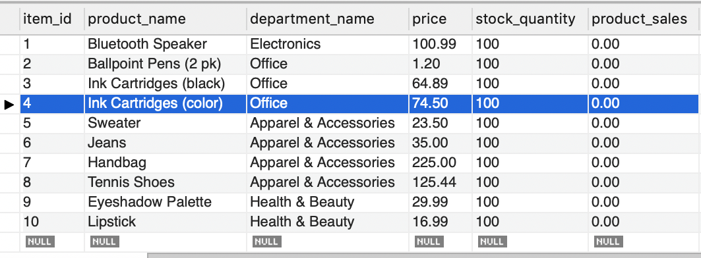
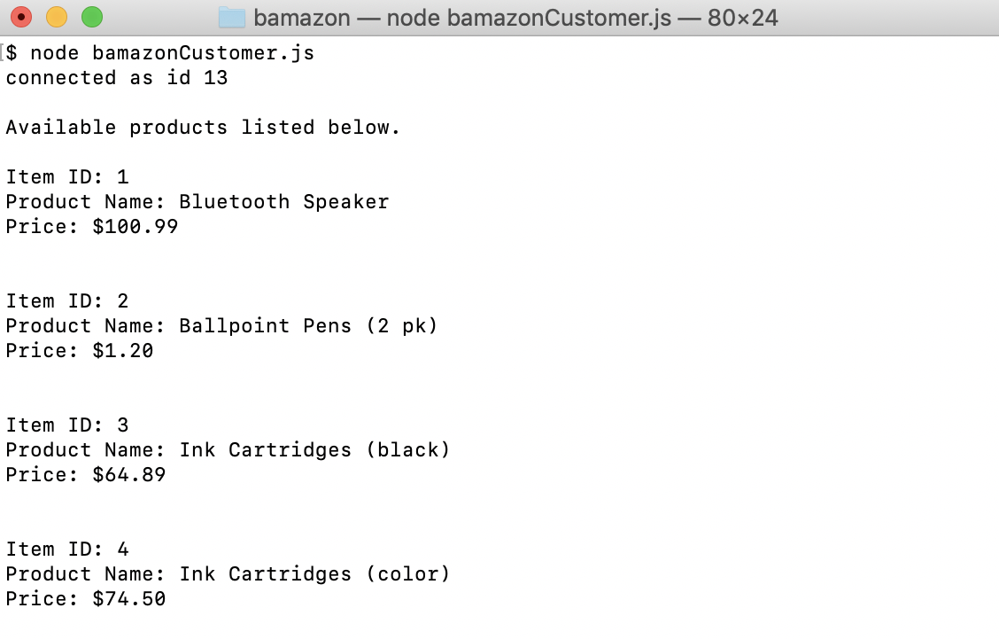
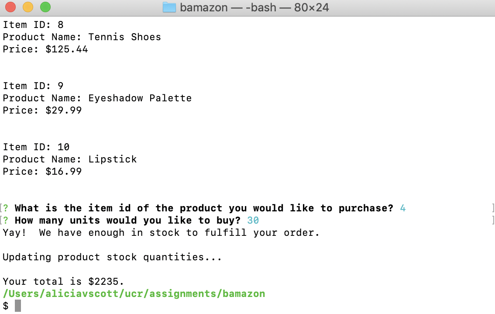
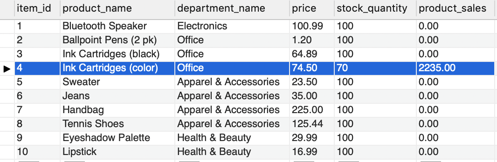

# bamazon
This app allows you to use and manage a Bamazon website.  As a customer, you can purchase items.  As a manager, you can manage the inventory and add products for sale.  As a supervisor, you can track the overall sales of each department and add new departments.

---
## Instructions

### How to Use
There are 3 views available for the user.  They are the **customer view**, **manager view**, and **supervisor view**.  You access all 3 of these views in your terminal via the command line.

#### Customer View
The customer view allows the user to purchase a product from the bamazon store.  Type `node bamazonCustomer.js` on the command line in the terminal then press enter.  A list of items available for purchase will display.  

The user will then be prompted to enter the ID of the item they want to purchase.  After a valid item ID is entered, the user will be prompted to enter the desired quantity.  If there is sufficient inventory available, the user will be presented with their total.  

The product table will update the iventory and display the total sales for the proudct.

#### Manager View
To search for song details, go to your terminal in the folder where the liri.js file is stored.  Type `node liri.js spotify-this-song <ENTER SONG TITLE HERE>` then press enter.  If no song title is entered, it will search for *"The Sign"* by Ace of Base.  The screen will display the artist or band name, the song title, a preview link to the song on *Spotify*, and name of the album the song is on.  Below is a screenshot of what the output will look like.

#### Supervisor View
To search for movie details, go to your terminal in the folder where the liri.js file is stored.  Type `node liri.js movie-this <ENTER MOVIE TITLE HERE>` then press enter.  If no movie title is entered, it will search for *"Mr. Nobody"*.  The movie title, stars of the film, year the movie came out, *IMDB* rating, *Rotten Tomatoes* rating, country where the film was produced, the language the movie is in, and the plot will appear on the screen.  Below is a screenshot of what the output will look like.

#### Do-What-It-Says
This command runs based upon preloaded search item in the `random.txt` file.  To run, go to your terminal in the folder where the liri.js file is stored.  Type `node liri.js do-what-it-says` then press enter.  LiriBot will read the `random.txt` and perform the search designated in that file.  The output will be the same as what was described above based upon the search designed in the file.  For the example below, the `random.txt` file had *spotify-this-song,"I Want it That Way"* in it.  The screenshot below captures what was displayed after `node liri.js do-what-it-says` was run.

---

## Dependencies
* Node.js
* Node Packages
    * MySql
    * Inquirer
    * Dotenv

---
## Contributing
This is a student shopping app created by Alicia Scott.