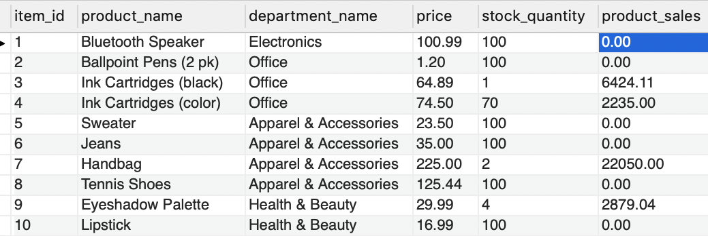
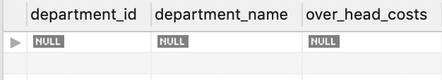

# bamazon
This app allows you to use and manage a Bamazon website.  As a customer, you can purchase items.  As a manager, you can manage the inventory and add products for sale.  As a supervisor, you can track the overall sales of each department and add new departments.

---
## Instructions

### How to Use
There are 3 views available for the user.  They are the **customer view**, **manager view**, and **supervisor view**.  You access all 3 of these views in your terminal via the command line.

#### Customer View
The customer view allows the user to purchase a product from the bamazon store.  Type `node bamazonCustomer.js` on the command line in the terminal then press enter.  A list of items available for purchase will display.  

The user will then be prompted to enter the ID of the item they want to purchase.  After a valid item ID is entered, the user will be prompted to enter the desired quantity.  If there is sufficient inventory available, the user will be presented with their total.  

The product table will update the iventory and display the total sales for the proudct.

---
#### Manager View
The manager view allows the user to manage the inventory.  Type `node bamazonManager.js` on the command line in the terminal then press enter.  After running this command, a list of the 4 menu items will display.  The menu items are **View Products for Sale**, **View low inventory**, **Add To Inventory**, and **Add New Product**.

View Products for Sale allows you to see a list of available products.

View Low Inventory allows you to see a list of the items that need to be restocked.  These items have less than 5 available.

Add to Inventory allows the user to add to the inventory for any item currently in the store.  The user will be prompted to enter the ID that is being restocked and the quantity being added.

Add New Product allows the user to add a new item to the store.  The user will be prompted to give the name of the product, the department, the price, and the quantity.

---
#### Supervisor View
The supervisor view allows the user to supervise the departments.  Type `node bamazonSupervisor.js` on the command line in the terminal then press enter.  After running this command, a list of the 2 menu items will display.  The menu items are **View Product Sales by Department** and **Create New Department**.

View Product Sales by Department allows the user to view the overhead costs, total sales, and total profit of each department.

Create New Department allows the user to add a new department to the table.  

The user will be prompted to enter the name of the department and the overhead cost.  The table will then be updated to reflect the new department.

---

## Dependencies
* Node.js
* Node Packages
    * MySql
    * Inquirer
    * Dotenv
    * CLI Table

---
## Contributing
This is a student shopping app created by Alicia Scott.